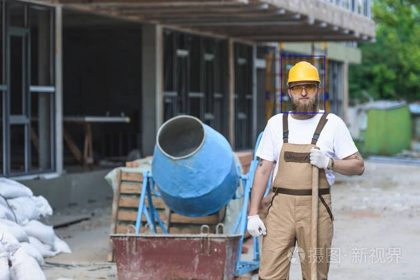

# Tensort-yolov5
简单的TensoRT yolo5 CPP 版本  


# 安装
## docker
+ TensorRT 8.6.1
+ nvidia driver 535

1. 本地电脑需要安装nvidia驱动  
``` sudo apt install -y nvidia-driver-535 ```

2. 采用简单易部署的docker环境来运行本代码,可参考
``` https://github.com/NVIDIA/trt-samples-for-hackathon-cn/tree/master/cookbook ```

3. 下载项目后，运行如下docker命令  
+ Start the container

```shell
docker run -it -e NVIDIA_VISIBLE_DEVICES=0 --gpus "device=0" --name trt-cookbook \
--shm-size 16G --ulimit memlock=-1 --ulimit stack=67108864 \
-v ~:/work \
nvcr.io/nvidia/pytorch:23.04-py3 /bin/bash
```
# 运行

## 构建tensorRT engine
可以使用如下方法构建需要定制的engine。
1. 使用tensorRT构建
2. 使用python 脚本构建（PTQ）  
(1)需要更改模型文件和校准数据集的路径.  
(2)更改配置文件。
```
cd calibration
pip install pycuda
python3 ptq.py
```

## 推理
直接用cmake构建本项目即可。 需要将模型路径和图片路径改为自己的路径
